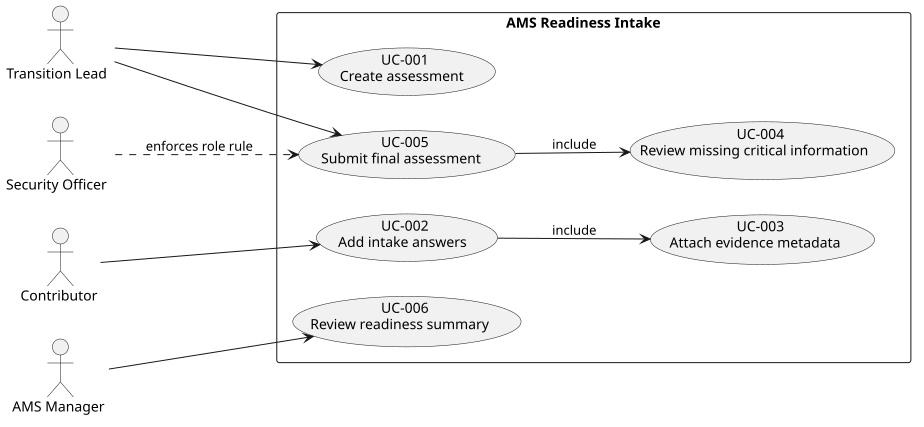

# Use Cases

## Use Case Diagram

## UC-002 — Add intake answers

- Primary actor: Contributor
- Goal: Record answers to critical readiness questions with supporting evidence.
- Preconditions: An assessment exists with status "Draft".
- Trigger: Contributor opens an assessment to fill in or update answers.
- Related requirements: REQ-002, REQ-003

### Main flow
1. Contributor selects a draft assessment.
2. Contributor selects a readiness question.
3. Contributor answers Yes/No/Partial, with an optional note.
4. Contributor attaches evidence with metadata (source, owner, freshness date).
5. System saves the answer and evidence against the assessment.
6. System records an audit log entry for the create/update action.

### Alternative flows
- AF-1: Contributor updates a previously saved answer instead of creating a new one.

### Exceptions
- EX-1: Evidence is submitted without source, owner or freshness date - system rejects the save and shows a validation error.

### Postconditions
- Success: The answer and its evidence are stored and linked to the assessment.
- Failure: No data is saved; the Contributor sees which fields are missing.

## UC-005 — Submit final assessment

- Primary actor: Transition Lead
- Goal: Submit an assessment after confirming no unresolved critical gaps exist.
- Preconditions: An assessment exists with status "Draft"; the actor has the Transition Lead role.
- Trigger: Transition Lead chooses to submit the assessment as final.
- Related requirements: REQ-005, REQ-008

### Main flow
1. Transition Lead opens the assessment.
2. System reviews missing critical information.
3. If no critical items are missing Transition Lead confirms submission.
4. System changes the assessment status to "Submitted".
5. System records an audit log entry for the submission action.

### Alternative flows
- AF-1: If critical items are missing, the system displays them and returns to editing.

### Exceptions
- EX-1: A user without the Transition Lead role attempts to submit - the system rejects the action and shows an authorization error.

### Postconditions
- Success: Assessment status is "Submitted"; no further edits are allowed.
- Failure: Assessment remains in "Draft" status; the rejection reason is shown.

## UC-007 — Review audit trail

- Primary actor: Transition Lead
- Goal: Review who and when created, changed or removed readiness assessment information to support an audit of the decision process.
- Preconditions: At least one Assessment/Answer/Evidence create, update or delete action has occurred.
- Trigger: Transition Lead (or Security Officer) opens the audit trail for a given assessment.
- Related requirements: REQ-011, REQ-012

### Main flow
1. Transition Lead selects an assessment.
2. System retrieves all audit log entries linked to that assessment's Assessment, Answer and Evidence records.
3. System displays each entry with actor, role, action type, affected entity/field, timestamp and old/new value.

### Alternative flows
- AF-1: Transition Lead filters entries by entity type (Assessment, Answer, Evidence) or by actor.

### Exceptions
- EX-1: No audit entries exist yet for the assessment - system shows an empty state, not an error.

### Postconditions
- Success: The requested audit entries are displayed, unaltered.
- Failure: N/A.