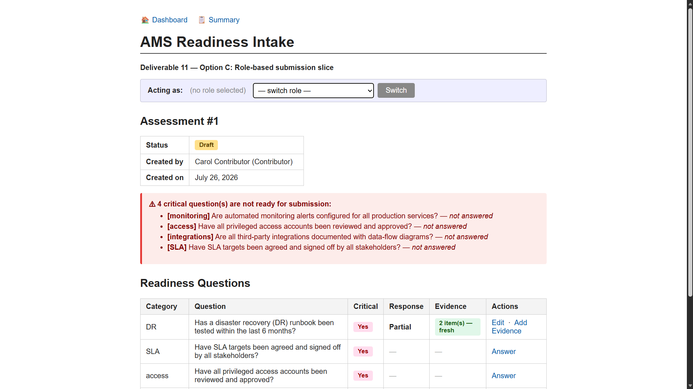
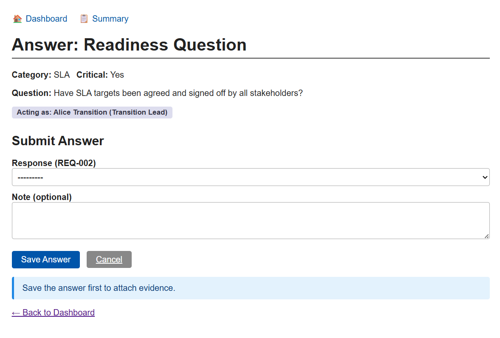
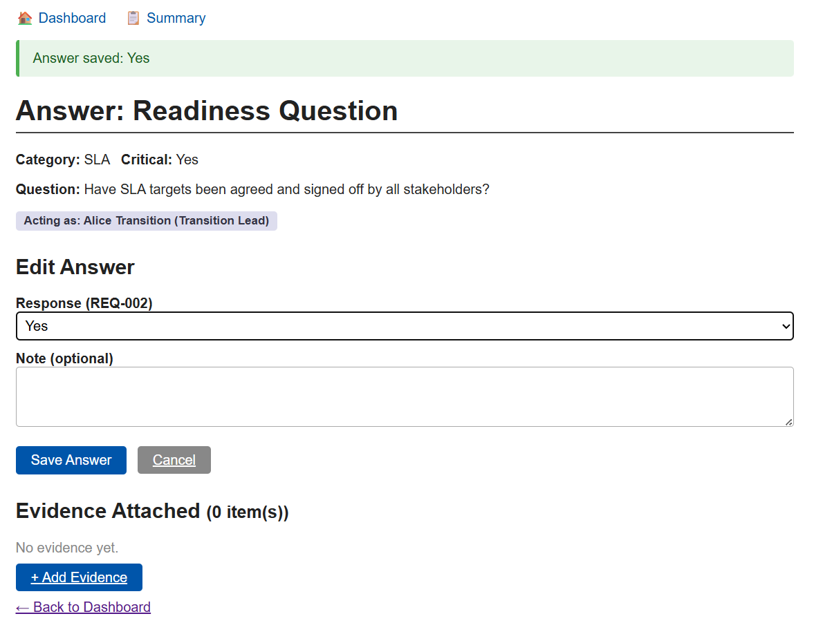
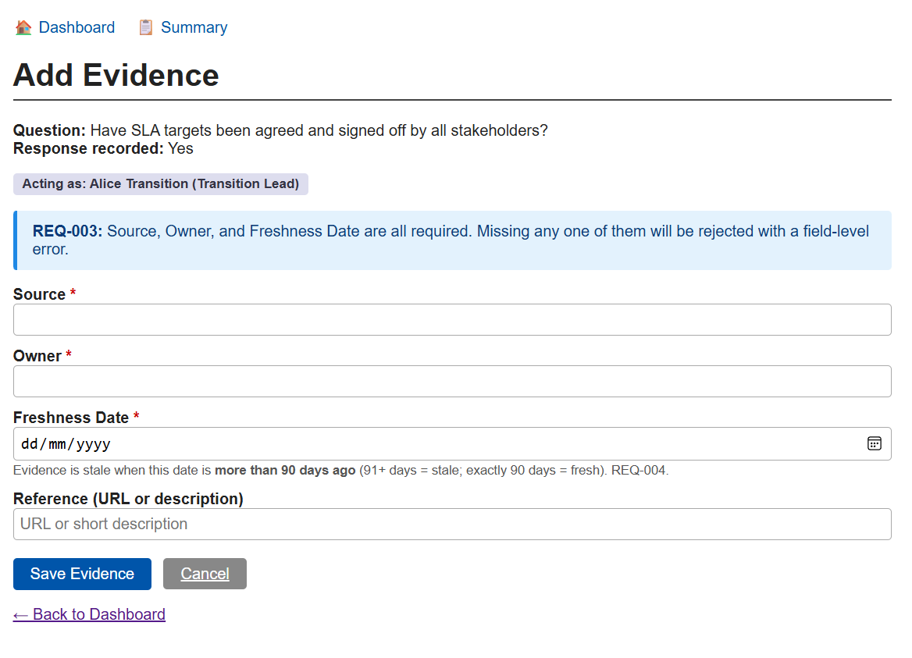
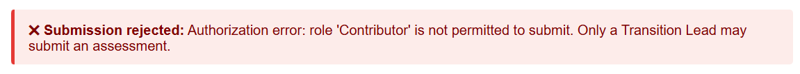
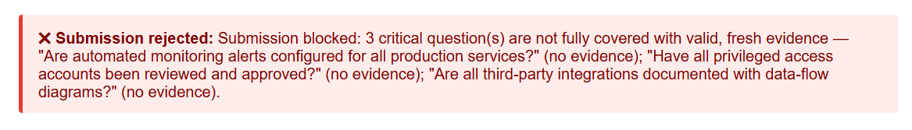
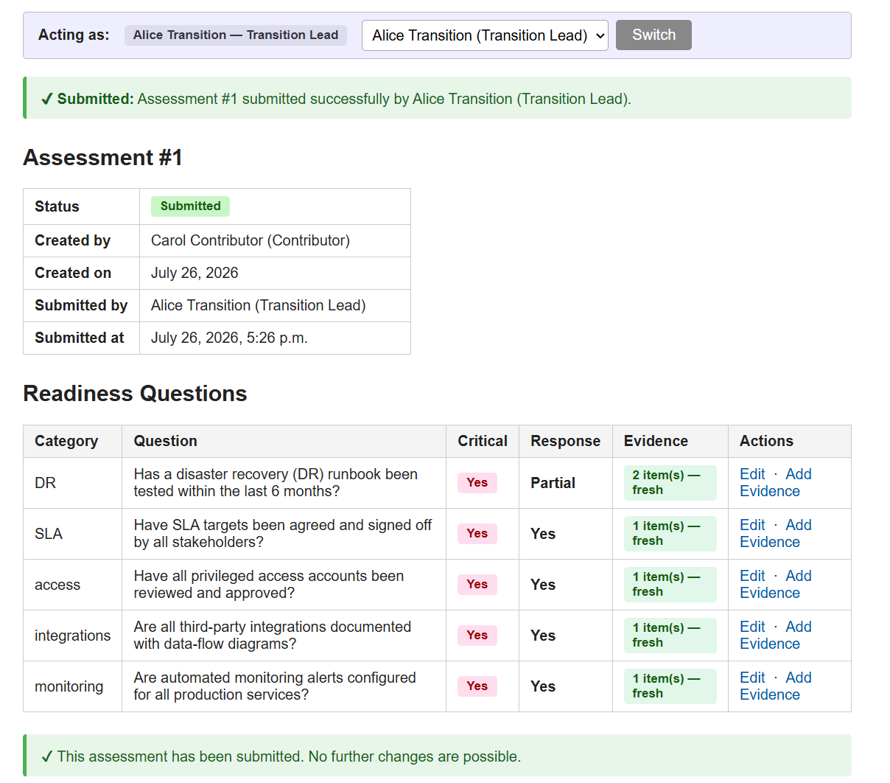
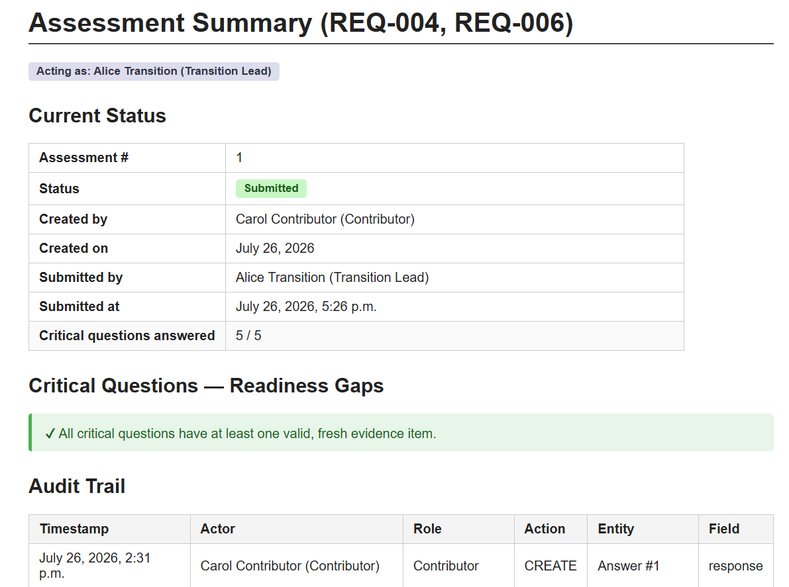
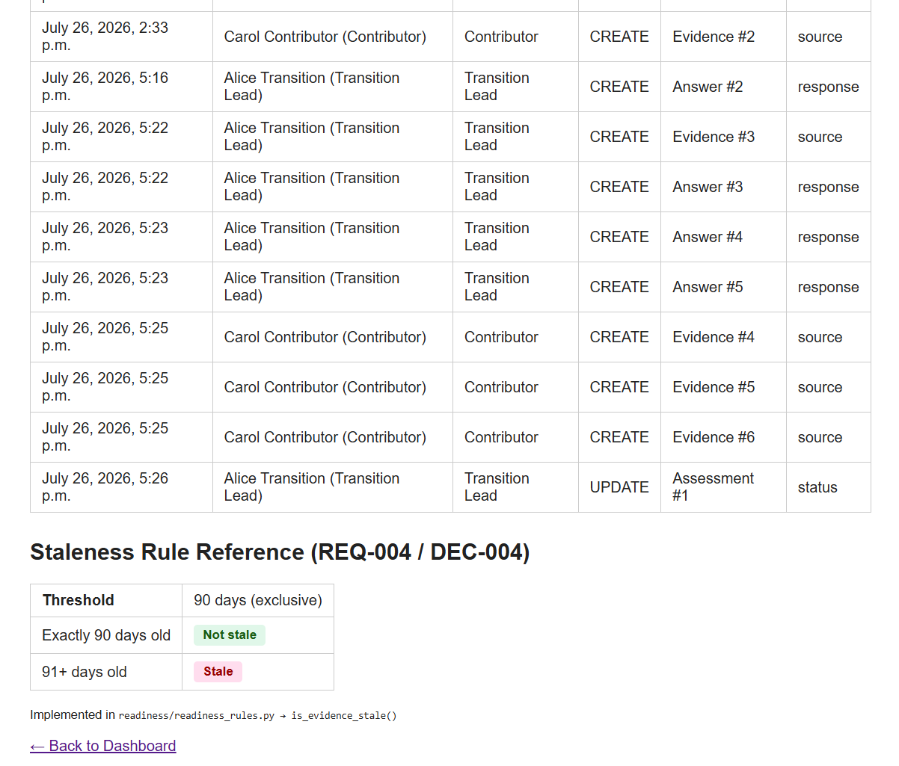
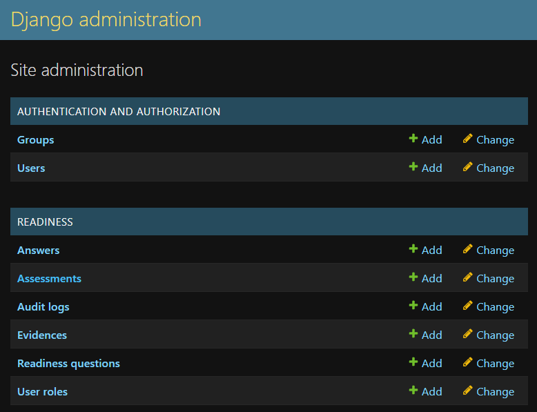

# Screenshots or Notes

## 1. Home / Dashboard

- Shows a role selector (`RoleSelectForm`) — dropdown of the 4 seeded `UserRole` rows 
  (Transition Lead, AMS Manager, Contributor, Security Officer). Selecting one sets 
  "Acting as: <name> (<role>)", shown as a badge on every subsequent page.
- Lists all 5 seeded `ReadinessQuestion` rows (category + critical flag), each linking to its 
  answer form.
- Shows the readiness summary block: current `Assessment` status ("Draft"/"Submitted") and, if 
  in Draft, the list of critical questions still missing valid evidence, each with a reason 
  ("not answered" / "no evidence attached" / "evidence is stale").
- A "Submit final assessment" button/form, only meaningful when acting as Transition Lead.

## 2. Answer a question

- Displays the question text, category, and whether it is critical.
- Shows the current acting role badge, or a warning "No role selected" if none is set.
- Form with a `response` dropdown (Yes/No/Partial) and an optional `note` field — "Save Answer" 
  button.
- **First visit (no existing answer):** heading reads "Submit Answer"; evidence section shows 
  "Save the answer first to attach evidence."
  

- **After saving:** heading changes to "Edit Answer"; an "Evidence Attached (0 item(s))" section 
  appears with a "+ Add Evidence" button, since an `Answer` row now exists.
  

- **Re-visiting an already-answered question:** the response dropdown is pre-filled with the 
  saved value (form bound to `instance=existing`); saving again updates the same row and logs 
  an `AuditLog` entry with `action_type="UPDATE"` and the previous response as `old_value` 
  (per the manual fix applied — see Deliverable 11).

## 3. Attach evidence

- Form fields: source, owner, freshness_date (date picker), reference.
- **Missing a required field (e.g. owner left empty):** form re-renders with a field-level error 
  ("Owner is required.") from `EvidenceForm.clean_owner()`; no `Evidence` row is created, and no 
  `AuditLog` entry is written (nothing was saved) — matches TC-003.
- **All fields valid:** redirects back to the answer page; the new evidence row now appears in 
  the "Evidence Attached" table, with a staleness badge:
  - "Fresh" (green) if `freshness_date` is 90 days old or less.
  - "STALE (>90 days)" (red) if more than 90 days old — matches TC-005 (exactly 90 = Fresh) and 
    TC-006 (91 days = Stale).
- An `AuditLog` entry is written with `action_type="CREATE"`, `entity_type="Evidence"`.

## 4. Submit assessment

- **Acting as Contributor (or any non-Transition-Lead role) and attempting to submit:** request 
  is rejected; an authorization error message is shown ("Role 'Contributor' is not authorized to submit the assessment."); assessment status remains "Draft" — matches TC-008.

- **Acting as Transition Lead, with at least one critical question missing/stale evidence:** 
  submission is blocked; the home page's missing-items list is shown/re-displayed with the 
  specific reason(s) — matches TC-004.

- **Acting as Transition Lead, all critical questions answered with fresh evidence:** assessment 
  status changes to "Submitted"; `submitted_by` and `submitted_at` are recorded; an `AuditLog` 
  entry logs the status change (`old_value="Draft"`, `new_value="Submitted"`) — matches TC-002.

## 5. Summary view

- Read-only view of the current assessment: status, list of any remaining missing/stale critical 
  items (empty once submitted), and the full audit trail for the assessment — actor, role, action 
  type, entity type/id, field changed, old/new value, and timestamp, ordered chronologically — 
  matches TC-009 (summary) and TC-010 (audit entries visible).
- No edit or delete controls exist anywhere on this page for `AuditLog` rows — there is no such 
  view/URL in `readiness/urls.py`, so entries are read-only by construction, matching TC-011/REQ-012.

## 6. Django admin (`/admin/`)

- After the manual fix (adding `django.contrib.admin`/`auth` to `INSTALLED_APPS` and wiring the 
  `/admin/` URL — see Deliverable 11 Manual changes), logging in with the superuser created via 
  `createsuperuser` shows all 6 registered models (`UserRole`, `Assessment`, `ReadinessQuestion`, 
  `Answer`, `Evidence`, `AuditLog`), useful for quickly inspecting the underlying data.

